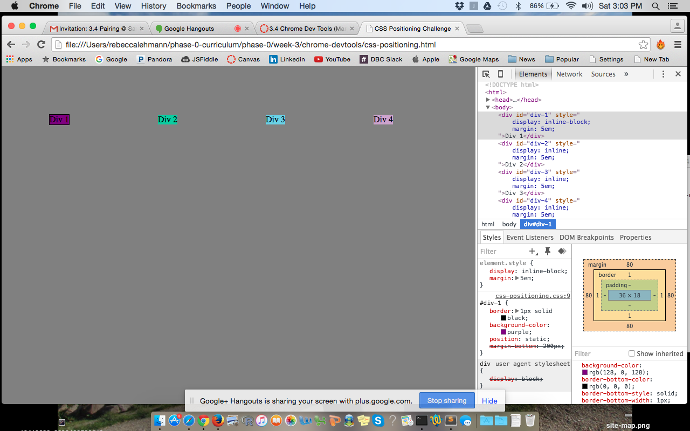

##How can you use Chrome's DevTools inspector to help you format or position elements?

You can override the css in devtools, to test what it will look like, or even individually disable lines of css.

##How can you resize elements on the DOM using CSS?

setting their 'width' 'height' and maybe their 'size' attributes

##What are the differences between Absolute, Fixed, Static, and Relative positioning? Which did you find easiest to use? Which was most difficult?

Static positioning is the default, and objects will be placed by where they are in the flow. Relative leaves a blank space where the object used to be and then gets drawn somewher else. Absolute positions the object from its ancestor. Fixed positions the object in the window and doesn't move when scrolled. We ended up using fixed the most to get our headers and footers.

##What are the differences between Margin, Border, and Padding?

margin is space on the outside of the object. border is the line, visible or not, around the edge of the object. padding is the space between the edge of the object and its content.

##What was your impression of this challenge overall? (love, hate, and why?)

I feel that me and my partner may have adopted bad practices because we didn't know the best way to get it done. I definitely learned a lot, but I got the impression on some of the questions that we didn't do what they meant us to do. DevTools was very glitchy, I might prefer just using sublime text.
