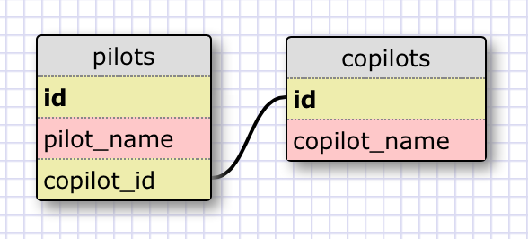
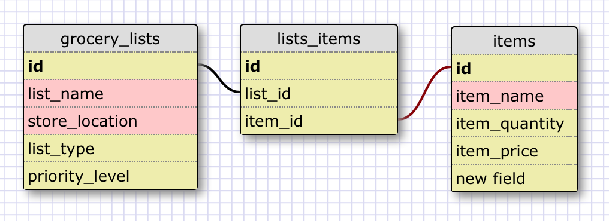

Every pilot only has a copilot, and the copilots all only have a pilot. Or at least i'm pretending that in this airline that it's true, maybe they can switch who they are paired with but not for any particular day or flight.

##What is a one-to-one database?
When each line in a table is linked to one line in another table.

##When would you use a one-to-one database? (Think generally, not in terms of the example you created).
When there is extra information related to your entries that you only have to deal with some of the time, and so to simplify things you put it in a separate table.

##What is a many-to-many database?
When two tables have items that are connected with many items in the other table, both ways.

##When would you use a many-to-many database? (Think generally, not in terms of the example you created).
For any situation where items could be grouped in multiple ways, even when many to many isn't neccessary it could be good to be prepared in case the data suddenly needs it.

##What is confusing about database schemas? What makes sense?
I kind of wish that I could just put an array in the entry to hold ids for many to many, so that the mediating table can be skipped.
